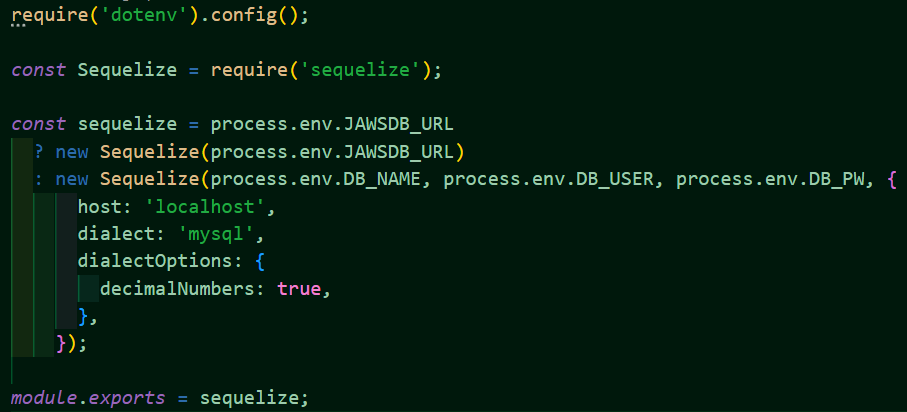
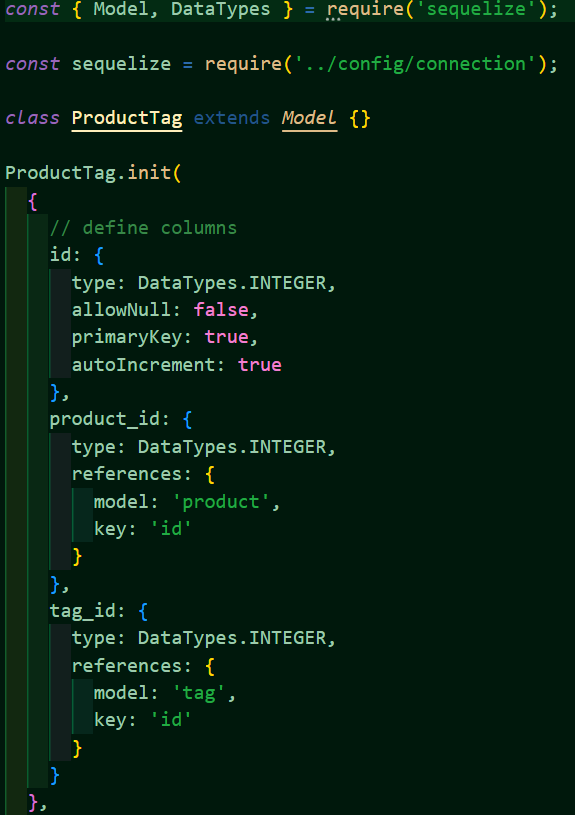

# Ecommerce backend
The ecommerce backend was created to help users maintain the backend for an ecommerce store.

## Description

The ecommerce backend aides users in creating and maintaining the backend for an ecommerce store. A MySQL database is created for the items in the ecommerce store, and can be accessed through GET, POST, PUT, and DELETE API routes in Insomnia as there is no front end.

## Technologies Used

- JavaScript
- MySQL
- Sequelize
- Express
- dotenv
- Insomnia

## Usage and Website

[The ecommerce backend](https://kirstgonz.github.io/ecommerce-backend/) helps users keep track of inventory for their ecommerce store. 

If you want to run this from the command line, you must first 'npm init -y' and then 'npm i' in the root directory. Then, you will need to add a file named '.env' to the root of the folder. Within this file, the user will want to add their database name, database user, and database password. 
It should look like the following. However, replace the DB_PW to be your password for your mySQL account.

DB_NAME= 'ecommerce_db'

DB_USER= 'root'

DB_PW= 'mySQLpassword'

Then, you need to open the mysql terminal. This can be done by typing 'mysql -u root -p' into the command line or gitbash. Then, you will enter your mySQL password (that is the same used in DB_PW). Then type 'source db/schema.sql', 'quit', and 'npm run seed'. Following, ensure that 'sequelize.sync({ force: false })' is set to FALSE in the server.js file found in the root folder. Then type 'npm run start'. Then, you can use the Insomnia application to test the different routes.

Below is an example of the code found in the config folder under the file named connection.js. This code establishes a connection to SQL through Sequelize.

Below is an example of the code found in the models folder under the file named ProductTag.js. This creates a class.

## Credits

Starter code made by [Xander Rapstine](https://github.com/Xandromus) 
Built on by [Kirstyn Gonzalez](https://github.com/kirstgonz)

## License

[https://choosealicense.com/](https://choosealicense.com/).
